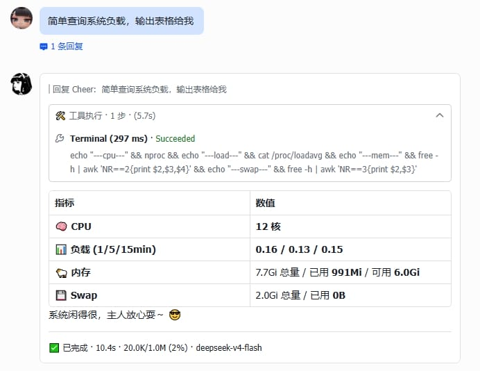

<h1 align="center">🚀 hermes-lark-streaming</h1>

<p align="center">
<a href="https://github.com/Cheerwhy/hermes-lark-streaming"></a>


<a href="https://opensource.org/licenses/MIT"></a>
</p>

> **What is this?** A Hermes Agent plugin that provides Feishu/Lark CardKit v2.0 streaming message cards — real-time AI response display with typing effect, tool panels, reasoning, and more. Now supports `hermes plugins install/uninstall` for seamless lifecycle management.

<p align="center">
  <a href="#features">Features</a> •
  <a href="#quick-start">Quick Start</a> •
  <a href="#configuration">Configuration</a> •
  <a href="#architecture">Architecture</a> •
  <a href="#migration-from-ast-version">Migration</a>
</p>

---

## Features

- ✅ **Streaming cards** — AI responses display in real-time within interactive cards, with typing effect
- ✅ **Linear mode** — Dynamically renders thinking, tool calls, and answer content in a single card, respecting Feishu's 200-element limit
- ✅ **Thinking process** — Display model reasoning/thinking content
- ✅ **Tool calls** — Real-time tool call status and progress with standard icons and result/error blocks
- ✅ **CardKit v2.0** — Prioritizes Feishu CardKit streaming API, auto-fallback to IM PATCH
- ✅ **Terminal cards** — Complete result display after finishing, including token usage, elapsed time, context info
- ✅ **Message guard** — Auto-terminate updates when messages are deleted/recalled, avoiding unnecessary API calls
- ✅ **Image parsing** — Auto-identify markdown image references, download and upload to replace with Feishu img_key
- ✅ **Interrupt handling** — Handle /stop commands and message interruptions, display interrupt status card and auto-start new session
- ✅ **Cron card push** — Scheduled task results pushed as Feishu cards, preserving Markdown rendering
- ✅ **Multi-language** — Built-in Chinese/English bilingual card text (status, tool panels, thinking labels, etc.), auto-switch based on Feishu client language
- ✅ **Plugin lifecycle** — Install/uninstall via `hermes plugins install/uninstall`, no source file modification required



---

## Quick Start

### Prerequisites

- [Hermes Agent](https://github.com/NousResearch/hermes-agent) (running, with Feishu platform configured)
- Python >= 3.11
- Hermes CLI with plugin support (`hermes plugins` command available)

### Install

```bash
hermes plugins install https://github.com/Cheerwhy/hermes-lark-streaming
```

When prompted, type `Y` to enable the plugin, then restart the gateway:

```bash
hermes gateway restart
```

### Uninstall

```bash
hermes plugins uninstall hermes-lark-streaming
hermes gateway restart
```

### Verify Installation

```bash
# Check plugin status
python -m hermes_lark_streaming status

# Verify environment compatibility
python -m hermes_lark_streaming verify

# Check gateway logs
grep hermes-lark-streaming ~/.hermes/logs/gateway.log
```

---

## Configuration

All settings are under the `streaming:` key in `~/.hermes/config.yaml`.

> **Note:** Hermes also has a native `display.streaming: false` setting in `config.yaml` — this controls the **CLI/TUI terminal** output (whether responses stream in the terminal), and is **unrelated** to this plugin's streaming cards. The plugin only reads the `streaming:` section.

### Available Options

```yaml
streaming:
  enabled: true              # Enable streaming cards
  linear: true               # Linear mode: single card updated in-place
  expanded: false           # Keep panels expanded during streaming
  panel_expanded: false      # Keep panels expanded on completion
  card_ttl_sec: 600         # Card liveliness check timeout (seconds)

  footer:
    fields:
      - status
      - elapsed
      - model
      - tokens
      - context
    show_label: true         # Show field labels (true/false)
```

### Feishu Credentials

The plugin reads credentials from (priority order):

| Priority | Source | Example |
|----------|--------|---------|
| 1 | Environment variables | `FEISHU_APP_ID`, `FEISHU_APP_SECRET` |
| 2 | File | `~/.hermes/.env` |
| 3 | Config file | `streaming.feishu.app_id` |

```bash
# Example ~/.hermes/.env
FEISHU_APP_ID=cli_xxxxxx
FEISHU_APP_SECRET=xxxxxx
FEISHU_BASE_URL=https://open.feishu.cn/open-apis
```

---

## Architecture

This plugin uses **runtime monkey patching** instead of AST source injection. When the plugin loads via `hermes plugins install`, it wraps methods on `GatewayRunner`, `AIAgent`, and `Scheduler` at runtime — no source files are modified on disk.

```
hermes-agent
  │
  ├─ gateway/run.py              ← hermes-lark-streaming wraps at import time
  │   └─ GatewayRunner._handle_message          → NORMALIZE
  │   └─ GatewayRunner._handle_message_with_agent → START + ABORT + INTERRUPT
  │   └─ GatewayRunner._run_agent               → COMPLETE + context
  │
  ├─ run_agent.py
  │   └─ AIAgent.run_conversation               → wraps all 6 callbacks
  │       ├─ stream_delta_callback              → ANSWER
  │       ├─ interim_assistant_callback         → THINKING
  │       ├─ tool_progress_callback             → TOOL
  │       ├─ reasoning_callback                 → REASONING
  │       └─ background_review_callback         → BACKGROUND_REVIEW
  │
  ├─ cron/scheduler.py
  │   └─ Scheduler._deliver_result              → CRON (Feishu only)
  │
  └─ hermes-lark-streaming plugin
      ├─ plugin.yaml          — manifest (name, version, hooks)
      ├─ __init__.py          — package root + register export
      ├─ __main__.py          — CLI (status / verify)
      ├─ plugin.py            — register(ctx) entry point (Hermes plugin discovery)
      ├─ monkey_patch.py      — runtime monkey patching (method wrappers)
      ├─ patch.py             — 11 hook functions (called by wrappers)
      ├─ config.py            — Configuration reader
      ├─ controller.py        — StreamCardController (session management)
      ├─ controller_mixin.py  — retry/downgrade mixin
      ├─ controller_linear_mixin.py — linear mode card orchestration
      ├─ feishu.py            — Feishu Open API client (lark-oapi SDK)
      ├─ cardkit.py           — CardKit v2.0 card builder
      ├─ cardkit_i18n.py      — Chinese/English i18n
      ├─ cardkit_md.py        — Markdown processing
      ├─ linear.py            — linear mode state tracking
      ├─ text.py              — incremental text accumulator
      ├─ tooluse.py           — tool call tracing and visualization
      ├─ image.py             — async image upload
      ├─ flush.py             — throttled flush scheduler
      └─ unavailable_guard.py — message unavailable guard
```

### Dependencies

| Package | Version | Purpose |
|---------|---------|---------|
| `lark-oapi` | >= 1.4.0 | Feishu Open API SDK |
| `PyYAML` | >= 6.0 | YAML configuration parsing |

---

## Migration from AST Version

If you previously used the AST injection version of hermes-lark-streaming (v0.7.0 and below), follow these steps to migrate:

### Step 1: Remove old AST patches

```bash
# If you still have the old version installed
python -m hermes_lark_streaming uninstall

# Or restore from backup
python -m hermes_lark_streaming restore
```

### Step 2: Uninstall old pip package

```bash
pip uninstall hermes-lark-streaming -y
```

### Step 3: Install as Hermes plugin

```bash
hermes plugins install https://github.com/Cheerwhy/hermes-lark-streaming
hermes gateway restart
```

### Key Differences from AST Version

| Aspect | AST Version (≤0.7.0) | Plugin Version (≥0.8.0) |
|--------|:--------------------:|:-----------------------:|
| Installation | `python -m hermes_lark_streaming install` | `hermes plugins install` |
| Uninstallation | `python -m hermes_lark_streaming uninstall` | `hermes plugins uninstall` |
| Source file modification | ✅ Modifies gateway/run.py | ❌ No file changes |
| Backup files | Creates .hermes_lark.bak | Not needed |
| Version compatibility | AST anchors may break | Runtime wrapping adapts |
| Multi-instance | ❌ File-level conflicts | ✅ Memory-level isolation |
| Security | Requires file write permission | No extra permissions |
| Plugin discovery | Manual pip install | Hermes plugin system |

---

## License

MIT
