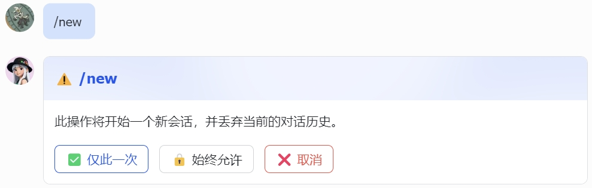

# feishu-slash-confirm

> 该工具由 AI 生成



用于 Hermes Agent 飞书斜杠命令（`/new`、`/reset`、`/undo`、`/reload-mcp`）的交互式确认卡片。

当您输入斜杠命令时，不再显示纯文本确认提示，而是弹出带三个按键的交互卡片：

- ✅ **一次** — 仅本次允许
- 🔒 **始终** — 始终允许（记住偏好）
- ❌ **取消** — 取消命令

## 安装

```bash
hermes plugins install https://github.com/lookatlook-666/feishu-slash-confirm
hermes gateway restart
```

### 卸载

```bash
hermes plugins uninstall feishu-slash-confirm
hermes gateway restart
```

## 工作原理

该插件通过 monkey-patch 飞书适配器实现：

1. 添加 `send_slash_confirm` — 发送带确认/始终/取消按钮的交互式 CardKit 卡片
2. 包裹 `_on_card_action_trigger` — 处理按钮点击，通过 `tools.slash_confirm.resolve()` 解析斜杠命令

## 支持的命令

- `/new` — 新建对话
- `/reset` — 重置会话
- `/undo` — 撤销上条消息
- `/reload-mcp` — 重新加载 MCP 工具

## 许可证

MIT
