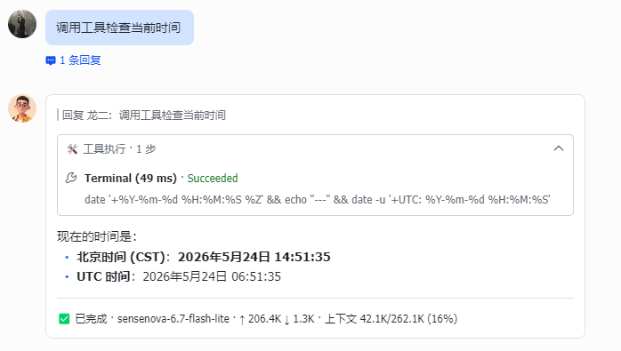

<h1 align="center">hermes-lark-streaming</h1>

<p align="center">
  
  <a href="https://larkcommunity.feishu.cn/wiki/DKkpwgMcJiglIhk88N4cqJEan5f?from=from_copylink"></a>
  <a href="https://opensource.org/licenses/MIT"></a>
  
  
</p>

<p align="center">
<a href="https://applink.feishu.cn/client/message/link/open?token=AmoQJk5dwczIahKlW78ADLU%3D"></a>
</p>

<p align="center">
English | <a href="README.zh-CN.md">中文版</a>
</p>

Feishu/Lark CardKit v2.0 streaming cards plugin for Hermes Agent — real-time AI response display with typing effect, tool panels, reasoning, and more.

| > Based on [Cheerwhy/hermes-lark-streaming](https://github.com/Cheerwhy/hermes-lark-streaming) v0.7.0, with extensive refactoring and optimizations
| >
| > 📦 [GitHub Repository](https://github.com/lookatlook-666/hermes-lark-streaming)
>
> ⚠️ **Incompatible with the upstream plugin** — if you have the original `Cheerwhy/hermes-lark-streaming` installed, please uninstall it first before installing this version.

---

## Features

- **Streaming Cards** — Real-time AI response display in interactive cards with typing effect
- **Linear Mode** — Single-card dynamic rendering of thinking, tool calls and answers, with automatic card splitting
- **CardKit v2.0** — Prioritizes Feishu CardKit streaming API, auto-falls back to IM PATCH
- **Terminal Cards** — Shows complete results including token usage, elapsed time, etc.
- **Message Protection** — Auto-terminates updates when messages are deleted/recalled
- **Image Parsing** — Auto-detects markdown image references, downloads and uploads as Feishu img_key
- **Interrupt Handling** — Handles /stop command and message interrupts, displays interrupt status and auto-starts new session
- **i18n** — Built-in Chinese/English bilingual card text, auto-switches based on Feishu client language
- **Plugin Lifecycle** — Install/uninstall via `hermes plugins`, no source file modification required
- **Runtime Patches** — Uses monkey patching instead of AST injection, does not modify source files on disk



---

## Quick Start

### Prerequisites

- [Hermes Agent](https://github.com/NousResearch/hermes-agent) (running, with Feishu platform configured)
- Hermes CLI with plugin system support (`hermes plugins` command available)

### Installation

> 插件会自动读取 Hermes 的 `HERMES_HOME` 环境变量定位安装路径（默认 `~/.hermes`），非默认路径下无需额外操作。

```bash
hermes plugins install https://gitee.com/lookatlook-666/hermes-lark-streaming
# (GitHub mirror, pick whichever is faster for you)
```
or

```bash
hermes plugins install https://github.com/lookatlook-666/hermes-lark-streaming
```

Enter `Y` when prompted to enable the plugin, then restart the gateway:

```bash
hermes gateway restart
```

### Uninstallation

```bash
# 1. Clean up injected config (while plugin code is still available)
HERMES_PYTHON=~/.hermes/hermes-agent/venv/bin/python3
$HERMES_PYTHON -m hermes_lark_streaming cleanup

# 2. Remove plugin
hermes plugins uninstall hermes-lark-streaming

# 3. Restart gateway
hermes gateway restart
```

> **Why not `python3 -m`?** Hermes runs in its own virtual environment. The system `python3` does not have the plugin's dependencies (e.g. `PyYAML`, `lark-oapi`), so `python3 -m hermes_lark_streaming` will likely fail. Use `HERMES_PYTHON` (Hermes venv's Python) instead. If Hermes is installed in a non-default path, adjust accordingly.

### Verify Installation

```bash
# Check plugin status
hermes plugins list

# View gateway logs
grep hermes_lark_streaming ~/.hermes/logs/agent.log

# Verify plugin config & credentials (uses Hermes's Python)
HERMES_PYTHON=~/.hermes/hermes-agent/venv/bin/python3
$HERMES_PYTHON -m hermes_lark_streaming status
```

> **Troubleshooting**: If no card effect appears after installation, check: (1) `hermes plugins list` shows the plugin as enabled; (2) no backup directory exists under `~/.hermes/plugins/` (remove any `*.bak` directories); (3) Feishu credentials are configured (see [Feishu Credentials](#feishu-credentials)).

---

## Configuration

All configuration items are located under the `streaming:` section in `~/.hermes/config.yaml`.

> **Auto-injection**: When this plugin is first loaded, it automatically adds the `streaming:` section to your `config.yaml` top-level with the defaults below. On uninstall, run the `cleanup` command (see [Uninstallation](#uninstallation)) first to remove this section.

> **Note**: Hermes also has a native `display.streaming: false` config which controls **CLI/TUI terminal** output. This is unrelated to this plugin's streaming cards.

### Plugin Enable Configuration

Enable this plugin in `~/.hermes/config.yaml`:

```yaml
plugins:
  enabled:
    - hermes-lark-streaming
  disabled: []
```

If the `plugins` section doesn't exist, add it manually. You can also enable via command after installation:

```bash
hermes plugins enable hermes-lark-streaming
```

To disable:

```bash
hermes plugins disable hermes-lark-streaming
hermes gateway restart
```

### Available Configuration Options

```yaml
streaming:
  enabled: true              # Enable streaming cards
  linear: true               # Linear mode: single card in-place update with auto card splitting
  panel_expanded: false      # Keep panels (tools, reasoning) expanded in completed cards
  card_ttl_sec: 600         # Card alive detection timeout (seconds)
  inject_time: false         # Inject current time before user messages (see Time Injection below)

  footer:
    fields:
      - [status, elapsed, model, api_calls]
      - [tokens, context, history_offset, compression_exhausted]
      # Available fields:
      #   status      — Reply status (✅ Completed / ❌ Error / 🛑 Stopped)
      #   elapsed     — AI response elapsed time
      #   model       — Model name used
      #   api_calls   — Number of API calls in this session
      #   tokens      — Token usage (↑ input ↓ output)
      #   context     — Context window usage (used/total percentage)
      #   history_offset — Conversation history offset; larger = longer history, sudden decrease = context compression
      #   compression_exhausted — Context window is full, compression can no longer fit (⚠ Context Full)
      # Each inner list is one row in the footer; fields only shown when they have values
    show_label: true         # Show field labels (true/false)
```

### Time Injection (`inject_time`)

When `streaming.inject_time: true`, the plugin prepends the current time to each user message so the AI model can perceive the current time without calling the `date` tool.

**Format**: `<time>HH:MM:SS</time> <original message>` (e.g., `<time>14:30:05</time> Hello`)

**Why XML-style tags?**
- LLMs universally understand XML tags as structured metadata — they won't mimic the format in their responses
- Bracket-prefixed time (``[14:30:05 CST]``) can be ignored as noise by some models, or worse, mimicked in their output
- Date is omitted because Hermes's system prompt already contains the current date
- Timezone suffix is omitted because the system prompt establishes timezone context

**Key characteristics**:
- **Prefix cache safe**: The time prefix is written to the conversation database along with the original message, ensuring that the history loaded from the DB in the next turn matches what the API received. This preserves prefix cache consistency — **zero extra cache impact** in all scenarios (always-on, always-off, mid-session enable/disable).
- **Token overhead**: ~6 tokens per user message; cumulative ~(N-1)×6 tokens for an N-turn conversation.
- **Side effect**: Conversation viewer (e.g., Hermes web UI) will show the time prefix in user messages.
- **Edge case handling**: In group chats where `persist_user_message` is already set by the gateway (observed_group_context), the time prefix is also added to `persist_user_message` to avoid losing it.

### Feishu Credentials

The plugin reads credentials in the following priority order:

| Priority | Source | Example |
|----------|--------|---------|
| 1 | Environment Variables | `FEISHU_APP_ID`, `FEISHU_APP_SECRET` |
| 2 | File | `~/.hermes/.env` |
| 3 | Config File | `streaming.feishu.app_id` |

```bash
# ~/.hermes/.env example
FEISHU_APP_ID=cli_xxxxxx
FEISHU_APP_SECRET=xxxxxx
FEISHU_BASE_URL=https://open.feishu.cn/open-apis
```

### Reasoning Panel Display

The reasoning panel visibility is controlled by `display.show_reasoning` or `display.platforms.feishu.show_reasoning`:

```yaml
display:
  show_reasoning: true  # Show reasoning panel in Feishu cards
```

---

## Developer Guide

> 📖 **[SKILL.md](SKILL.md)** — LLM 快速上手指南 / Quick-start knowledge card for LLMs. Read this document to immediately understand the project architecture, key design decisions, common pitfalls, and efficiently make code changes or extend features.

---

## Changelog

> See [CHANGELOG.md](CHANGELOG.md) for full version history.

---

## Acknowledgments
